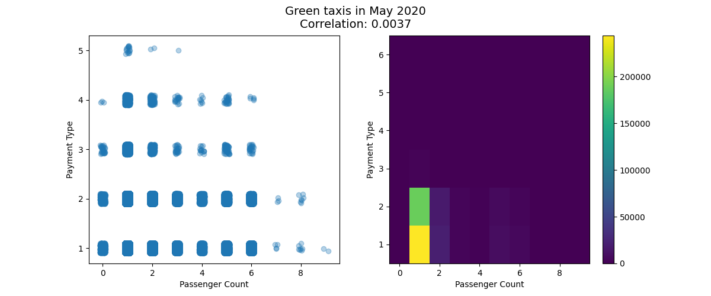

# aws-taxi
New York Taxi data analysis project

### Getting Started
1. Sign in Amazon EMR
2. Create cluster
3. Connect to the cluster’s master node using SSH.
4. ```aws s3 cp s3://taxi-data-new-york/conf.sh .```  to download configure script
5. ```sh conf.sh``` to install necessary libraries
6. ```spark-submit TaxiDataAnalysis.py``` to start the project

### Overview
TaxiDataAnalysis.py - implementation of data analysis on taxi trip records in New York City. As a result of data processing, we obtain correlation charts of payment type and passenger count, which are saved in the png format. 
conf.sh - script for the installation of the necessary libraries.

All charts are created by cluster and then stored in s3 in png format.

### Example

#### Chart description
Passenger count - the number of passengers in the vehicle.
Payment Type - a numeric code signifying how the passenger paid for the trip. 
1= Credit card \
2= Cash \
3= No charge \
4= Dispute \
5= Unknown \
6= Voided trip \

In this case data are very weakly correlated. It means payment type and passenger count are independent of each other.

### Technologies
Spark \
Python \
EMR \
s3 \

### Report
The main problems in the project was additional installation of libraries because we had to update pip first. 
